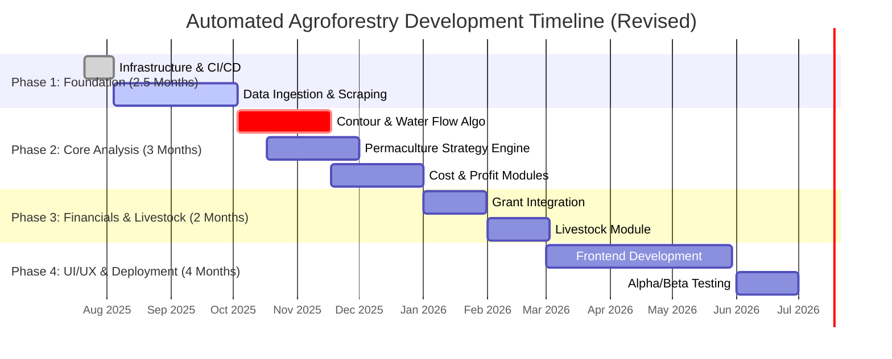

```mermaid
gantt
    title Automated Agroforestry Development Timeline (Revised)
    dateFormat  YYYY-MM-DD
    axisFormat  %b %Y

    section Phase 1: Foundation (2.5 Months)
    Infrastructure & CI/CD   :done, 2025-07-21, 14d
    Data Ingestion & Scraping:active, 2025-08-04, 60d

    section Phase 2: Core Analysis (3 Months)
    Contour & Water Flow Algo :crit, 2025-10-03, 45d
    Permaculture Strategy Engine   :2025-10-17, 45d
    Cost & Profit Modules   :2025-11-17, 45d

    section Phase 3: Financials & Livestock (2 Months)
    Grant Integration       :2026-01-01, 30d
    Livestock Module        :2026-02-01, 30d
    
    section Phase 4: UI/UX & Deployment (4 Months)
    Frontend Development    :2026-03-01, 90d
    Alpha/Beta Testing      :2026-06-01, 30d
```